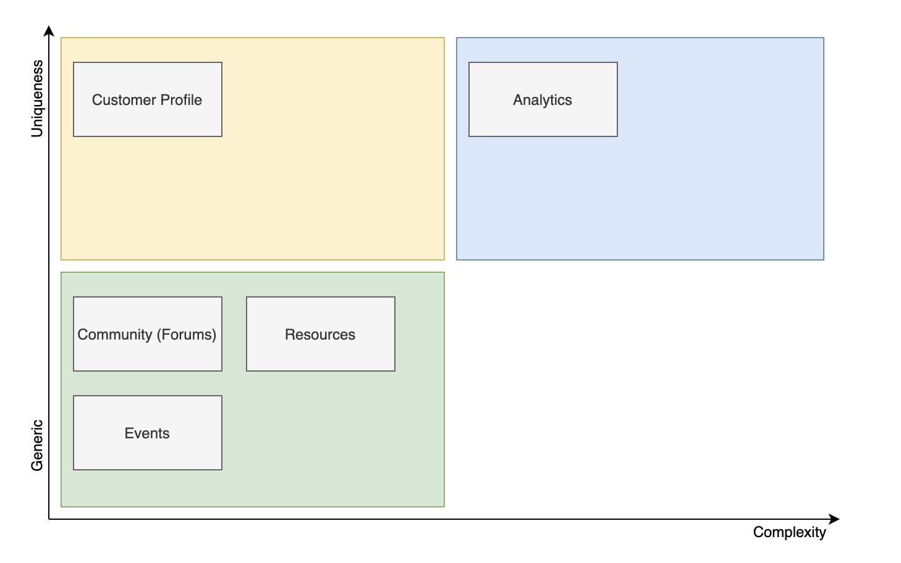
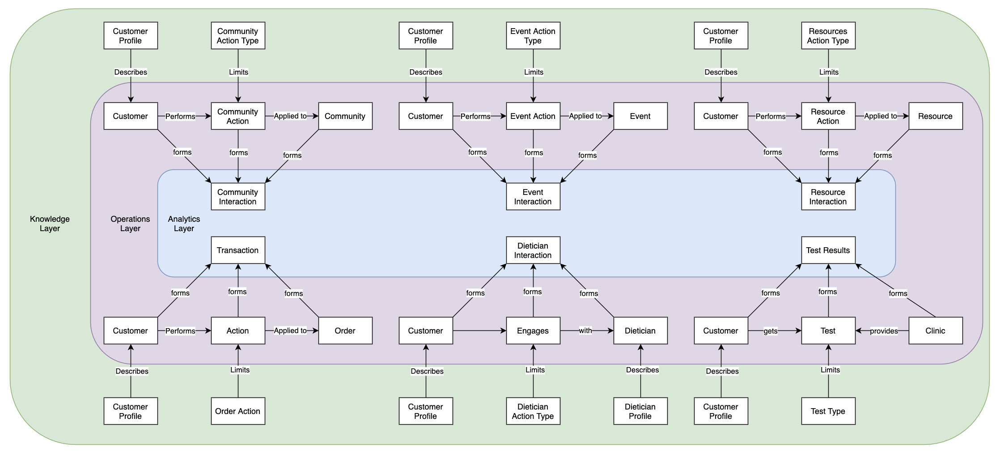
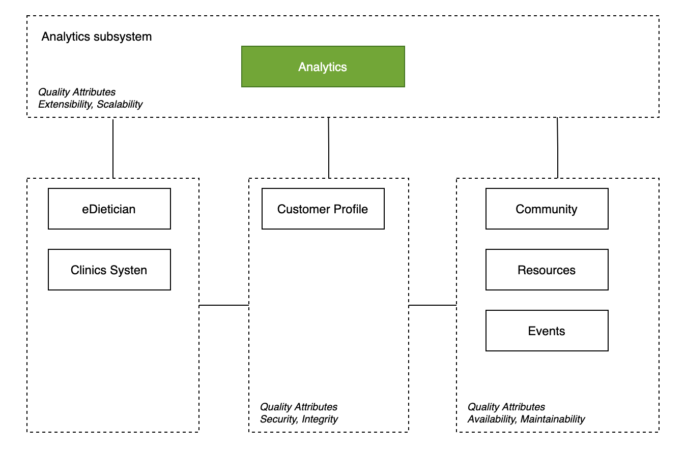
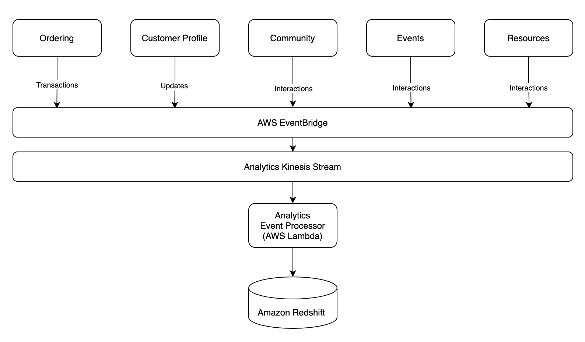

# Solution Overview

### Driving Principles

1. Ability to integrate with FarmacyFoods is critical
2. Modifiability is important as needs - both transactional and analytical will evolve

### Style

The existing system (Farmacy Foods) is a modularized monolith comprising of multiple services. We plan to go with the same approach to model most components of Farmacy family i.e. Customer Profile, Community (Forums), Resources, Events can be modeled as independent services. However, for analytics components, we propose it as a separate subsystem that leverages a event-driven architecture.

**Analytics**

The data, interactions and insights of Farmacy Family are unique. Much of the development will be in building and deploying this module.

**Customer Profile**:

This is another core component. The Farmacy family profile will be a separate module that integrates with the Farmacy food profile in the ordering module.

**Community**, **Resources** and **Events**: This modules can be built with little customization with off-the-shelf services or reference architectures

**Additional Integration Points**

1. Farmacy Foods (Ordering)
2. eDietician
3. Clinics system

### Conceptual Model

*Knowledge level*** **describes rules on how actors/entities interact with each other

*Operational level*** **describe the main actors/entities involved in main scenarios

*Analytics level*** **describes the interactions captured for analytics needs

### Components

### The Analytics Subsystem

We propose a event driven architecture for the analytics subsystem. The driving principle here is extensibility and scalability. Any new modules in the system just need to publish events to EventBridge and be done. Processing, Extracting, Aggregating will then be handled by the analytics subsystem

AWS EventBridge and Kinesis complement each other. EventBridge provides event routing while Kinesis adds batching, partitioning and back-pressure.The events will be batched and processed by a lambda function and populate the corresponding analytics tables in Amazon Redshift.
