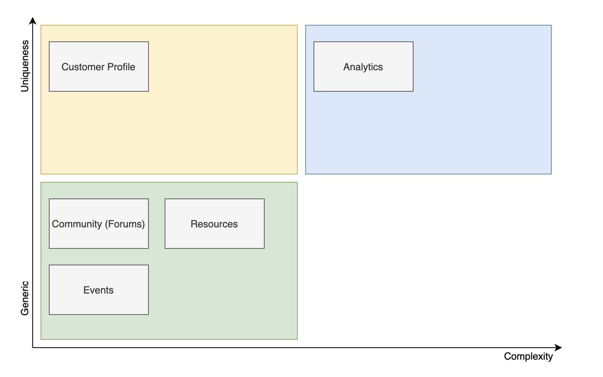
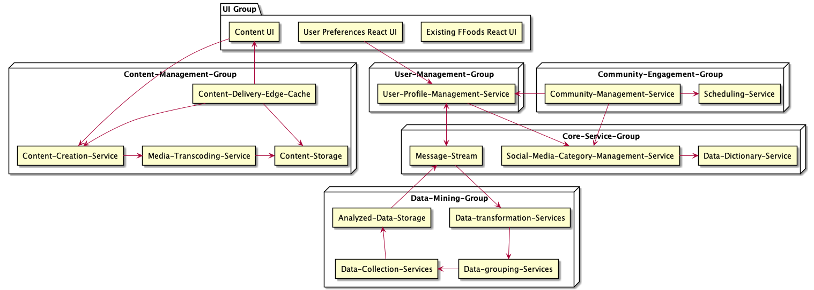
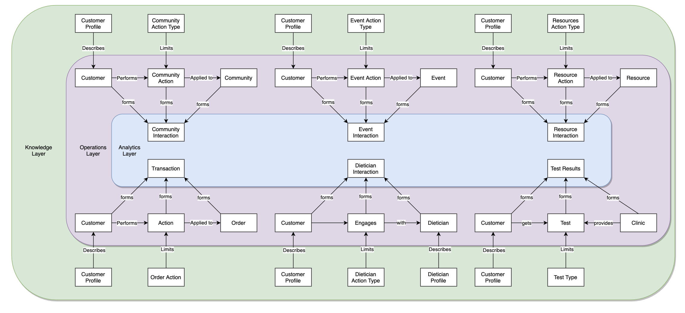
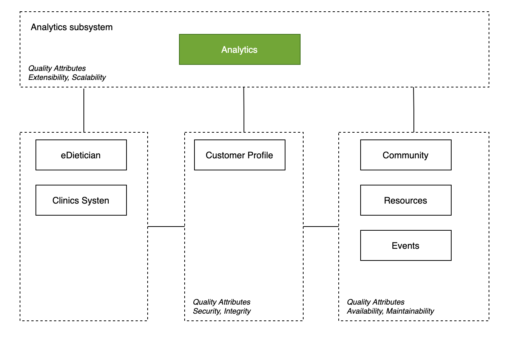
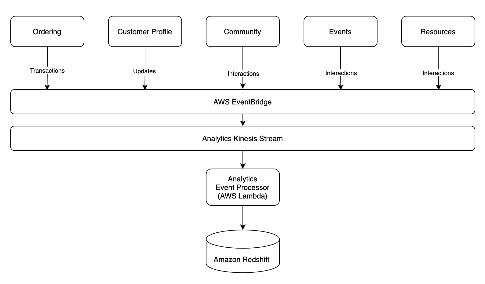

= Solution Overview

== Driving Principles

. Ability to integrate with FarmacyFoods is critical
. Modifiability is important as needs - both transactional and analytical will evolve

== Style

The existing system (Farmacy Foods) is a modularized monolith comprising multiple services. But here we plan to go with different approaches based on the quanta to model most components of Farmacy family i.e. Customer Profile, Community (Forums), Resources, and Events can be modeled as independent services. However, for analytics components, we propose it as a separate subsystem that leverages an event-driven architecture.

The proposed solution consists of multiple quanta addressing a specific need. Below are the list that we identified fo the given scope.

. User's profile/preference management group
.. Here we choose service-based architecture
. Community Engagement group
.. Here we choose Orchestrator driven service-based architecture
. Analytics
.. This group will be choreography based distributed architecture to support elasticity and scalability.
. Content management for blogs and forums
.. Here we choose service-based architecture
. Core or shared services

=== Components

=== Components Description

. Content-Management-Group
.. React based Content UI
====
This React based web application serves as a micro-frontend in combination with existing FFoods UI served under same domain.
This will support the User interaction for the community members through blogs, forums and more.
====
.. Content-Delivery-Edge-Cache
.. Content-Creation-Service
====
This service interacts with existing User profile service to authorize and migrate an existing transactional customer to engaged customer.
This service provides required support to capture user preferences in the overall engagement, data privacy and channels to interact through subscription.
This service also takes care of working with Transcoding Service to store and link media to content pages.
Then persist this content and retrieve it on demand.
====
.. Media-Transcoding-Service
====
This service takes care of transcoding videos and images.
====
.. Content-Storage
====
This is the storage service like AWS S3 where documents, videos and images are stored.
====

. User-Management-Group
.. User-Profile-Management-Service

. Community-Engagement-Group
.. React based Community Engagement UI
.. Community-Management-Service
.. Scheduling-Service

. Core-Service-Group
.. Social-Media-Category-Management-Service
.. Data-Dictionary-Service
====
This service maintains the verbatim for the entire platform so all the services talk same language regarding the dietary categories and more.
====
.. Message-Stream
====
This is service is to support the asynchronous communication which in our case can be AWS Kinesis or SNS or even Kafka.
====

. Data-Mining-Group
.. Data-transformation-Services
.. Data-grouping-Services
.. Data-Collection-Services
.. Analyzed-Data-Storage

=== Analytics

The data, interactions and insights of Farmacy Family are unique. Much of the development will be in building and deploying this module.

*Customer Profile*:

This is another core component. The Farmacy family profile will be a separate module that integrates with the Farmacy food profile in the ordering module.

*Community*, *Resources* and *Events*: This modules can be built with little customization with off-the-shelf services or reference architectures

*Additional Integration Points*

. Farmacy Foods (Ordering)
. eDietician
. Clinics system

=== Conceptual Model

_Knowledge level_** **Describes rules on how actors/entities interact with each other

_Operational level_** **Describe the main actors/entities involved in main scenarios

_Analytics level_** **Describes the interactions captured for analytics needs

=== Analytics Components

=== The Analytics Subsystem

The driving principle here is extensibility and scalability. Any new modules in the system just need to publish events to EventBridge and be done. Processing, Extracting, Aggregating will then be handled by the analytics subsystem.

AWS EventBridge and Kinesis complement each other. EventBridge provides event routing while Kinesis adds batching, partitioning and back-pressure.The events will be batched and processed by a lambda function and populate the corresponding analytics tables in Amazon Redshift.